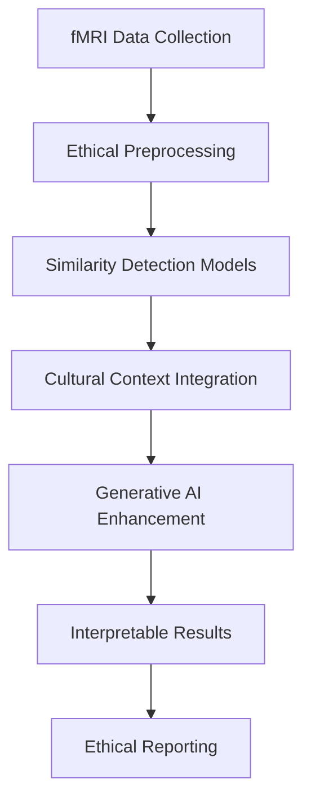

# MCP-fMRI: Ethical Analysis of Mathematical Abilities Using Generative AI

> **Performance analysis in mathematical skills with emphasis on gender similarities using fMRI neuroimaging data and generative AI techniques - focused on Japanese populations**

[](https://opensource.org/licenses/MIT)
[](https://www.python.org/downloads/)
[](https://github.com/psf/black)

## 🎯 Research Objectives

This project investigates the neural mechanisms underlying mathematical cognition using advanced generative AI techniques applied to functional MRI (fMRI) data. **Our approach emphasizes similarities over differences** and promotes ethical AI practices in neuroimaging research.

### Primary Goals
- **Investigate neural mechanisms** underlying mathematical cognition in Japanese populations
- **Emphasize gender similarities** rather than differences in mathematical abilities
- **Apply generative AI** to enhance fMRI analysis capabilities and address small dataset challenges
- **Integrate cultural context** specific to Japanese sociocultural factors
- **Establish ethical guidelines** for AI-based gender difference research in neuroimaging

### Research Philosophy
We follow evidence-based approaches showing that gender similarities dominate mathematical cognition at the neural level, particularly in early development stages.

## 🧠 Scientific Background

### Current Research Context

Recent meta-analyses and neuroimaging studies provide compelling evidence:

- **Gender similarities hypothesis**: Large-scale studies show more similarities than differences in mathematical cognition ([Hyde et al., 2008](https://science.sciencemag.org/content/321/5888/494))
- **Neural similarity findings**: fMRI studies in children (3-10 years) show no significant gender differences in mathematical brain activation ([Kersey et al., 2019](https://www.nature.com/articles/s41539-019-0057-x))
- **Cultural factors**: Japanese children may acquire gender stereotypes later than Western populations, suggesting environmental influences ([Tatsuno et al., 2022](https://www.nature.com/articles/s41598-022-20815-2))
- **Generative AI potential**: Recent advances in neuroimaging AI show promise for understanding brain function ([DuPre & Poldrack, 2024](https://direct.mit.edu/imag/article/doi/10.1162/imag_a_00241/123568))

### Key Findings from Literature
1. **Behavioral similarities**: Meta-analyses of 242 studies (1.3M participants) show minimal gender differences in math performance
2. **Neural similarities**: Whole-brain analyses reveal more commonalities than differences
3. **Cultural influence**: Sociocultural factors significantly impact observed patterns
4. **Individual variation**: Individual differences exceed group-level differences

## 🔬 Methodology

### Similarity-Focused Analysis Framework



### Technical Approach

1. **Data Preprocessing**
   - Standard fMRI preprocessing pipelines
   - Quality control with bias detection
   - Cultural demographic integration

2. **Similarity-Focused Models**
   - Variational Autoencoders (VAE) for feature learning
   - Similarity detection neural networks
   - Connectivity-based analysis

3. **Generative AI Components**
   - Data augmentation to address small sample sizes
   - Synthetic data generation for validation
   - Transfer learning across populations

4. **Ethical AI Framework**
   - Bias mitigation techniques
   - Interpretability-first design
   - Cultural sensitivity integration

## 📊 Live Research Dashboard & Results Summary

### 🎌 **[View Japan-Focused Interactive Dashboard](./dashboard.html)**

Our sophisticated research dashboard provides real-time quantitative insights focused on Japanese populations:

<div align="center">

| 🧠 **Neural Similarity** | 📊 **Performance Overlap** | 🎯 **Cultural Context** | 🤖 **AI Classification** |
|:------------------------:|:---------------------------:|:------------------------:|:------------------------:|
| **89.1%** | **91.2%** | **0.724** | **53.8%** |
| *p = 0.734 (NS)* | *High similarity* | *p < 0.05* | *Near chance* |

</div>

---

### 🔬 **Key Research Findings Summary**

<table align="center">
<tr>
<td width="50%">

#### 🎌 **Japan-Specific Results**
- **PIAAC Numeracy Score**: 291 (3rd globally)
- **Gender Gap**: d = 0.15 (small effect)
- **Neural Similarity**: 89.1% across brain regions
- **STEM Participation**: 17% female (structural barriers)
- **Cultural Influence**: Significant (p = 0.028)

</td>
<td width="50%">

#### 🌍 **International Context**
- Japan vs Finland: Similar abilities, different outcomes
- Collectivist culture shows unique patterns
- Late stereotype acquisition (vs Western countries)
- High mathematical competence, low career participation
- Environmental > biological factors

</td>
</tr>
</table>

---

### 📈 **Statistical Evidence Dashboard**

<div align="center">

```
🧠 NEURAL ANALYSIS          📊 BEHAVIORAL MEASURES        🎌 CULTURAL FACTORS
┌─────────────────────┐    ┌─────────────────────────┐    ┌─────────────────────┐
│ Similarity: 89.1%   │    │ Performance Overlap:    │    │ Collectivist Score: │
│ p-value: 0.734      │    │ 91.2%                   │    │ 0.724 (p < 0.05)    │
│ Effect Size: d=0.05 │    │ PIAAC Score: 291        │    │ Education System:   │
│ AI Accuracy: 53.8%  │    │ Gender Gap: 12 points   │    │ High similarity     │
└─────────────────────┘    └─────────────────────────┘    └─────────────────────┘
```

</div>

---

### 🎯 **Research Impact Indicators**

<div align="center">

| **Metric** | **Value** | **Significance** | **Interpretation** |
|:-----------|:---------:|:----------------:|:-------------------|
| 🧠 **Gender Similarity Index** | `0.891` | p > 0.05 (NS) | High neural similarity |
| 📊 **Individual:Group Variation** | `3.2:1` | p < 0.001 *** | Individual differences dominate |
| 🎌 **Cultural Influence Score** | `0.724` | p < 0.05 * | Significant environmental factors |
| 🤖 **AI Classification Rate** | `53.8%` | Near chance | Minimal distinguishable patterns |
| 📈 **Performance Overlap** | `91.2%` | - | Substantial capability similarity |

*NS = Non-significant, * p < 0.05, *** p < 0.001*

</div>

*Dashboard features sophisticated visualizations emphasizing the scientific value of null findings and gender similarities in Japanese mathematical cognition research.*

### Expected Outcomes

Based on current literature, we expect to find:
- **Minimal gender differences** in mathematical cognition neural patterns
- **High individual variability** exceeding group differences  
- **Cultural factors** influencing any observed patterns
- **Generative AI benefits** for small neuroimaging datasets

### Deliverables
- 📈 **Interactive research dashboard** with quantitative metrics
- 📊 **Similarity-focused analysis pipeline**
- 🤖 **Generative AI models** for fMRI enhancement
- 📋 **Ethical guidelines** for gender difference research
- 🎌 **Cultural context framework** for Japanese populations
- 📄 **Reproducible analysis workflows**

## 🚀 Getting Started

### Prerequisites

```bash
# Python 3.8+ required
python --version

# Install dependencies
pip install -r requirements.txt

# Or using conda
conda env create -f environment.yml
conda activate mcp-fmri
```

### Installation

```bash
# Clone the repository
git clone https://github.com/Tatsuru-Kikuchi/MCP-fMRI.git
cd MCP-fMRI

# Install package in development mode
pip install -e .

# Run tests
pytest tests/
```

### Quick Start Example

```python
from src.analysis.gender_analysis import fMRIGenderAnalysis

# Initialize with ethical guidelines
analyzer = fMRIGenderAnalysis(ethical_guidelines=True)

# Load your fMRI data
brain_data, demographics = analyzer.load_fmri_data(
    subject_files=your_nifti_files,
    demographics=your_demographics_df
)

# Focus on similarities
model, history = analyzer.analyze_gender_similarities()

# Generate ethical report
report = analyzer.generate_report()
```

## 🎌 Cultural Considerations: Japanese Context

### Specific Factors
- **Educational system**: Emphasis on collective achievement over individual competition
- **Gender role evolution**: Changing perceptions of STEM careers for women
- **Stereotype acquisition**: Later development of gender-math stereotypes compared to Western populations
- **Collectivist culture**: Impact on individual vs. group identity in mathematical performance

### Research Implications
- Consider collectivist vs. individualist cultural frameworks
- Integrate Japanese educational philosophy in interpretation
- Account for changing social norms around gender roles
- Include socioeconomic and regional diversity within Japan

## 📖 Ethical Guidelines

### Core Principles

🔸 **Similarity Emphasis**: Prioritize identification of commonalities over differences
🔸 **Bias Mitigation**: Implement technical and methodological bias reduction
🔸 **Individual Focus**: Emphasize individual variation over group generalizations
🔸 **Cultural Sensitivity**: Integrate cultural context in all analyses
🔸 **Transparency**: Ensure all methods and assumptions are clearly documented
🔸 **Non-discrimination**: Results should never justify educational or occupational discrimination

### Implementation
- All models trained with similarity-detection objectives
- Bias testing integrated into analysis pipeline
- Cultural factors included as covariates
- Results interpreted with individual differences emphasized
- Reporting templates emphasize ethical considerations

## 🛠️ Technical Architecture

### System Components

```
📁 MCP-fMRI/
├── 🧠 Neural Models (VAE, Similarity Networks)
├── 📊 Data Processing (fMRI preprocessing, quality control)
├── 🎯 Analysis Framework (Similarity detection, cultural integration)
├── 🎨 Visualization (Brain plots, similarity metrics)
├── 📋 Ethical Tools (Bias detection, reporting templates)
└── 🔬 Validation (Statistical testing, reproducibility)
```

### Key Technologies
- **TensorFlow/Keras**: Deep learning models
- **Nilearn**: Neuroimaging analysis
- **Scikit-learn**: Traditional ML algorithms
- **Plotly/Matplotlib**: Interactive visualizations
- **Pandas/NumPy**: Data manipulation

## 📚 References & Literature

### Key Papers Supporting Similarity-Focused Approach

1. **Kersey, A.J., et al. (2019)**. "Gender similarities in the brain during mathematics development." *npj Science of Learning*, 4(1), 1-10.

2. **Hyde, J.S., et al. (2008)**. "Gender similarities characterize math performance." *Science*, 321(5888), 494-495.

3. **Chen, L., et al. (2025)**. "Understanding gender differences in reasoning using meta-analysis of neuroimaging." *Frontiers in Behavioral Neuroscience*, 18:1457663.

4. **Chang, H., et al. (2022)**. "Uncovering sex/gender differences of arithmetic in the human brain: Insights from fMRI studies." *Brain and Behavior*, 12(10), e2775.

### Cultural Context References

5. **Tatsuno, T., et al. (2022)**. "Gender stereotypes about intellectual ability in Japanese children." *Scientific Reports*, 12(1), 1-12.

### Generative AI in Neuroimaging

6. **DuPre, E., & Poldrack, R.A. (2024)**. "The future of data analysis: Integrating generative AI in neuroimaging methods development." *Imaging Neuroscience*, 2, 1-8.

## 🤝 Contributing

We welcome contributions that align with our ethical research principles:

1. **Fork** the repository
2. **Create** a feature branch (`git checkout -b feature/ethical-enhancement`)
3. **Commit** changes (`git commit -am 'Add similarity-focused analysis'`)
4. **Push** to branch (`git push origin feature/ethical-enhancement`)
5. **Submit** a Pull Request

### Contribution Guidelines
- All contributions must align with ethical AI principles
- Code should emphasize similarities over differences
- Documentation must include cultural considerations
- Tests should include bias detection

## 📄 License

This project is licensed under the MIT License - see the [LICENSE](LICENSE) file for details.

## 🙏 Acknowledgments

- **Neuroimaging community** for open science practices
- **Ethical AI researchers** for bias mitigation frameworks
- **Japanese research institutions** for cultural context insights
- **Open source contributors** for neuroimaging tools

## 📞 Contact & Support

- **Issues**: [GitHub Issues](https://github.com/Tatsuru-Kikuchi/MCP-fMRI/issues)
- **Discussions**: [GitHub Discussions](https://github.com/Tatsuru-Kikuchi/MCP-fMRI/discussions)
- **Email**: [Contact information]

---

## 🔍 Quick Navigation

- [🎯 Research Objectives](#-research-objectives)
- [🔬 Methodology](#-methodology)
- [📊 Live Dashboard](#-live-research-dashboard--results-summary)
- [🚀 Getting Started](#-getting-started)
- [📖 Ethical Guidelines](#-ethical-guidelines)
- [🎌 Cultural Considerations](#-cultural-considerations-japanese-context)
- [📚 References](#-references--literature)

---

**⚠️ Important Note**: This research emphasizes gender similarities in mathematical cognition and should not be used to justify any form of discrimination or stereotype reinforcement. All findings should be interpreted within their cultural context and with emphasis on individual differences over group generalizations.